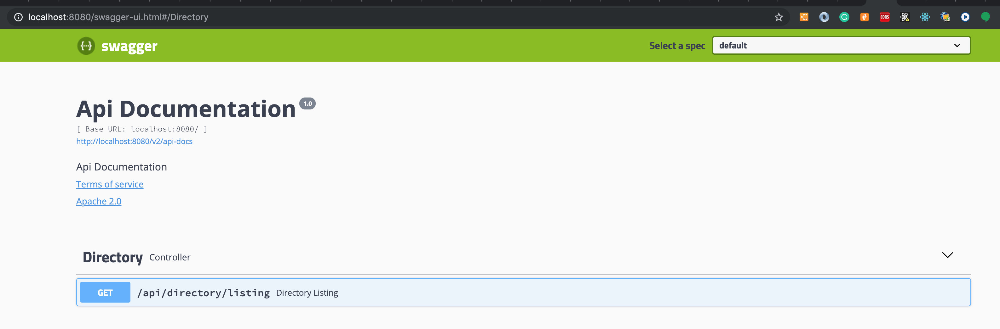

## Prerequisites

Install `Docker`

Install `Docker Compose`

Clone `git@github.com:SBNBON005/entersekt.git`

## Running

Once you clone repository simply run docker-compose up . This will pull pre-built prometheus and grafana images from public Docker Hub repository and build the test service.

```
$ cd /path/to/entersekt//directory
$ docker-compose up
```

## API Docs
We can see the swagger docs on:

```
http://localhost:8080/swagger-ui.html
```




## Testing it

Health Check Endpoint
```
http://localhost:8080/actuator/health
```

Getting directory list for ~/home

```
curl -i http://localhost:8080/api/directory/listing?start=1&end=3
```